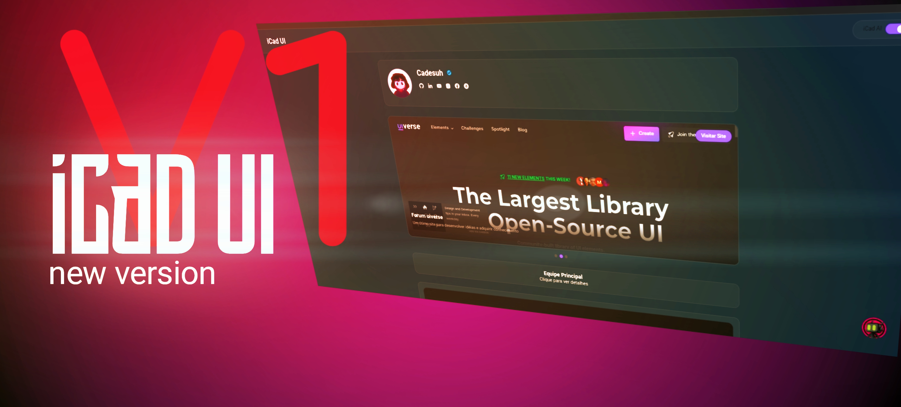

Projeto Frontend Moderno com Efeito Glass e IA Integrada 🌟

Um website pessoal desenvolvido para apresentações profissionais, caracterizado por:
• Design moderno com efeitos glassmorphism limpos e suaves
• Inteligência Artificial integrada no canto inferior direito
• Interface responsiva e intuitiva
• Animações sutis e elementos interativos
• Desenvolvido 100% em dispositivos móveis usando editores alternativos

Código otimizado para performance móvel, demonstrando que desenvolvimento profissional é possível mesmo sem IDEs tradicionais. Ideal para quem busca inspiração em interfaces modernas com funcionalidades inteligentes.

# 🌐 Portfólio Moderno com IA Integrada

[](https://github.com/Supot-tCad/V1-iCad.Ui/blob/main/LICENSE)




## ✨ Funcionalidades Principais
- 🪄 Efeito Glassmorphism premium
- 🤖 Assistente de IA integrado
- 📱 Design totalmente responsivo
- 🎨 Paleta de cores modernas e personalizáveis
- 🌈 Transições suaves e microinterações
- 📦 Código modular e bem estruturado

## 🛠 Tecnologias Utilizadas
- **Frontend**: HTML5, CSS3 (com variáveis customizadas), JavaScript ES6+
- **Efeitos Especiais**: Backdrop-filter, CSS Animations
- **IA**: Integração via API [iCad IA]
- 📲 Desenvolvido no editor [Code editor - Mobile]

## 🚀 Como Executar
```bash
git clone https://github.com/Suport-tCad/V1-iCad.Ui.git
cd seu-repositorio
# Abra o arquivo index.html em qualquer navegador moderno
